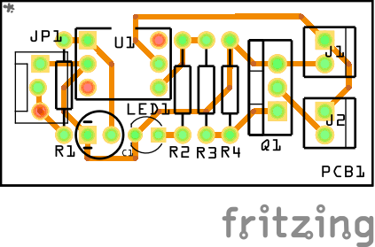
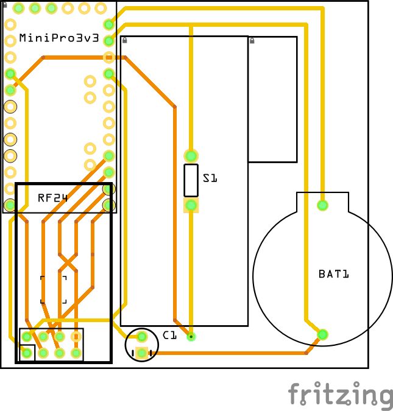

Dev notes

Resources
=========

- https://www.mysensors.org
- https://www.arduino.cc/en/Reference/HomePage (basic Arduino reference)
- https://www.aliexpress.com/store/731260 (Arduino hw)
- https://www.aliexpress.com/store/506373 (small parts)

Code
====

- Uno/Nano CH340G drivers : http://kig.re/2014/12/31/how-to-use-arduino-nano-mini-pro-with-CH340G-on-mac-osx-yosemite.html
- Mini Pro FTDI drivers: http://www.ftdichip.com/Drivers/VCP/MacOSX/FTDIUSBSerialDriver_v2_3.dmg
- MySensors library 2.0.0 (with examples) : https://github.com/mysensors/MySensors.git, or Library Manager in Arduino IDE
- examples and 3rd pary libraries : https://github.com/mysensors/MySensorsArduinoExamples.git

Inventory 
=========

 part        | price  |  # | info
 ----------- | ------:| --:| ----
`INFRA`      |  0,35€ |  1 | 1pcs IR Infrared Obstacle Avoidance Sensor Module for Arduino Smart Car Robot 3-wire Reflective Photoelectric New hei
`LIGHT`      |  0,36€ |  4 | 1pcs Photosensitive Sensor Module Light Detection Module for Arduino guang
`MT3608`     |  0,45€ |  4 | 1pcs MT3608 2A Max DC-DC Step Up Power Module Booster Power Module For Arduino
`SOIL`       |  0,46€ |  2 | Smart Electronics Soil Moisture Hygrometer Detection Humidity Sensor Module For arduino Development Board DIY Robot Smart Car tu
`REED`       |  0,49€ |  1 | 1pcs Reed sensor module magnetron module reed switch MagSwitch For Arduino
`RAIN`       |  0,50€ |  1 | 1set/lot Snow/Raindrops Detection Sensor Module Rain Weather Module Humidity For Arduino yu
`RF24ADAP`   |  0,61€ |  4 | New Socket Adapter plate Board for 8Pin NRF24L01 Wireless Transceive module 51
`NRF24L01+`  |  0,72€ | 12 | 1pcs Wireless Transceiver For Arduino NRF24L01+ 2.4GHz Antenna Module For Microcontroll
`HCSR501`    |  0,72€ |  4 | HC-SR501 Adjust IR Pyroelectric Infrared PIR Motion Sensor Detector Module
`HCSR04`     |  0,77€ |  2 | Ultrasonic Module HC-SR04 Distance Measuring Transducer Sensor for Arduino
`JUMPER`     |  0,81€ |  5 | 40pcs dupont cable jumper wire dupont line female to female dupont line 20cm 1P 40P SKUMM
`JUMPER`     |  0,86€ |  2 | male to female dupont line 40pcs dupont cable jumper wire dupont line 2.54MM 20cm for arduino SKUGM
`BH1750`     |  0,88€ |  4 | GY-302 BH1750 BH1750FVI light intensity illumination module for arduino 3V-5V
`JUMPER`     |  0,90€ |  2 | 40pcs dupont cable jumper wire dupont line male to male dupont line 20cm 1P diameter:2.54mm SKUGG
`LED`        |  1,08€ |  1 | 50pcs 5mm LED Light Assorted Kit DIY LEDs Set White Yellow Red Green Blue each=10pcs
`DHT11`      |  1,10€ |  4 | New DHT11 Temperature And Relative Humidity Sensor Module For Arduino
`UNOBOX`     |  1,12€ |  1 | One set Transparent Box Case Shell for Arduino UNO R3
`LCD1602`    |  1,24€ |  1 | 1pcs LCD1602 LCD monitor 1602 5V blue screen and white code for arduino
`MPU6050`    |  1,26€ |  1 | GY-521 MPU-6050 MPU6050 Module 3 Axis analog gyro sensors+ 3 Axis Accelerometer Module
`FT232BL`    |  1,40€ |  1 | FT232BL FT232 USB TO TTL 5V 3.3V Download Cable To Serial Adapter Module For Arduino USB TO 232
`BMP180`     |  1,42€ |  2 | 1PCS GY-68 BMP180 Replace BMP085 Digital Barometric Pressure Sensor Module For Arduino
`MINI5`      |  1,53€ |  4 | With the bootloader 1pcs ATMEGA328P Pro Mini 328 Mini ATMEGA328 5V/16MHz for Arduino
`MINI3`      |  1,53€ |  8 | With the bootloader 1pcs pro mini atmega328 Pro Mini 328 Mini ATMEGA328 3.3V/8MHz for Arduino
`RC522`      |  1,62€ |  1 | 1 set RFID module RC522 Kits 13.56 Mhz 6cm With Tags SPI Write & Read for arduino uno 2560
`NRF24L01+A` |  1,79€ |  2 | 1sets Special promotions 1100-meter long-distance NRF24L01+PA+LNA wireless modules (with antenna)
`UNOR3`      |  2,68€ |  1 | 1pcs New 2016 - UNO R3 ATmega328P/CH340G MicroUSB. Compatible for Arduino UNO Rev 3.0 (hei)
`MB102`      |  3,37€ |  1 | 3.3V/5V MB102 Breadboard power module+MB-102 830 points Solderless Prototype Bread board kit +65 Flexible jumper wires
`NANO`       | 13,94€ |  1 | 5pcs/set = 5pcs Nano 3.0+5pcs USB Cable ATmega328 Mini-USB Board CH340G for arduino
             |        |    |
             |        |    |
`8KEY`       |  1,59€ |  1 | 1pc Key Display For AVR Arduino New 8-Bit Digital LED Tube 8-Bit TM1638 Module
`MC38`       |  0,78€ |  6 | MC-38 1pair Wired Door Window Sensor 330mm Wire Lengthen Randomly Magnetic Switch Home Alarm System N.C Type
`LEDCLOCK`   |  0,78€ |  1 | 1pcs 4 Bits TM1637 Red Digital Tube LED Module & Clock for Arduino LED
`OLED12864`  |  2,92€ |  1 | 1pcs 4pin 0.96"white 0.96 inch OLED module New 128X64 OLED LCD LED Display Module For Arduino 0.96" IIC I2C Communicate
`DOTMATRIX`  |  1,01€ |  1 | MAX7219 dot matrix module microcontroller module DIY KIT
`VOICE`      |  0,43€ |  1 | 3pin Voice Sound Detection Sensor Module for Arduino DIY Intelligent Smart Vehicle Robot Helicopter Airplane Aeroplane BoartCar 
`KY040`      |  0,59€ |  2 | 1pcs Rotary Encoder Module Brick Sensor Development for arduino KY-040
`ULN2003KIT` |  1,86€ |  2 | 1set 5V 4-phase Stepper Driver Board ULN2003 kit for_Arduino
`PI3BOX`     |  1,77€ |  2 | Raspberry Pi 512 rev3 RPI3 Box case shell generation B+ acrylic shell latest box
`KF3012P`    |  0,67€ |  1 | 2015 New House Keeping 10pcs KF301-2P 5.08mm Blue Terminals Blue Screw Terminal 2P
`ACDC`       |  1,83€ |  4 | TSP-05 replace HLK-PM01 AC-DC 220V to 5V mini power supply module,intelligent household switch power supply module
`VIBR`       |  0,58€ |  1 | SW-420 Normally Closed Vibration Sensor Module for Alarm System DIY Smart Vehicle Robot Helicopter Airplane Aeroplane BoartCar
`EXPSHIELD`  |  0,93€ |  1 | Smart Electronics UNO Proto Shield prototype expansion board with SYB-170 mini breadboard based For Arduino UNO ProtoShieldDIY
`STICK`      |  0,51€ |  2 | Dual-axis XY Joystick Module For Arduino Joystick Module
`LCDADAPTER` |  0,66€ |  1 | IIC/I2C / Interface LCD1602 2004 LCD Adapter Plate for Arduino LCD 1602
`RELAY4`     |  1,82€ |  1 | 1pcs/lot 4 channel relay module 4-channel relay control board with optocoupler. Relay Output 4 way relay module for arduino
`SG90`       |  1,12€ |  2 | 1PCS 9g micro servo for airplane aeroplane 6CH rc helcopter kds esky align helicopter sg90
`VAMETER`    |  4,44€ |  1 | Hot Selling 1PC 5A Adjustable Power CC/CV Step-down Charge Module LED Driver Voltmeter Ammeter Constant current constantvoltage
             |        |    |
`PCB`        |  0,25€ | 10 | 86036 Free shipping 10pcs Double Side Prototype PCB diy Universal Printed Circuit Board 4x6cm
(OK) `BAT2AA`|  0,32€ | 10 | Plastic Battery Storage Case Box Holder For2 X AA 2xAA 3V+ wire leads
             |        |    |
`CAPA`       |  1,88€ |    | Capacitors:  10 each of: `0.22µF 50V`, `0.47µF 50V`, `1µF 50V`, `2.2µF 50V`, `4.7µF 50V`, `10µF 50V`, `22µF 50V`, `33µF 16V`, `47µF 16V`, `100µF 16V`, `220µF 16V`, `470µF 16V`
`DIODE`      |  1,51€ |    | Diodes:      1N4148 1N4007 1N5819 1N5399 1N5408 1N5822 FR107 FR207,8values=100pcs,Electronic Components Package,Diode Assorted Kit
`TRANS`      |  2,59€ |    | Transistors: 18valuesX10pcs=180pcs 2N2222 S9012 S9013 S9014 A1015 C1815 S8050 S8550 TO-92 Transistor Assorted Kit
`RES`        |  2,40€ |    | Resistors:   600 Pcs 1/4W 1% 20 Kinds Each Value Metal Film Resistor Assortment Kit

Templates
=========

`MINI3` Mini Pro 3v3 template
-----------------------------

parts: `MINI3`, `NRF24L01+`, `FT232BL` (reuse), `47µF 16V` (cap)

connections: 

code: [sketch](templates/ms-mini-3v3.ino)

RGBW Led dimmer
---------------

parts: `OPTO`, `MOSFET`, ...

connections: 

Sensors
=======

`SGW` Serial Gateway
--------------------

parts: `NANO`, `NRF24L01+A`, `RF24ADAP`

connections: 

code: [sketch](ms-serial-gateway/ms-serial-gateway.ino)

`BUT` One Button
----------------

parts: `MINI3`, `NRF24L01+`, `47µF 16V` (cap), Legrand switch + case

connections:

code: [sketch](ms-one-button/ms-one-button.ino)
